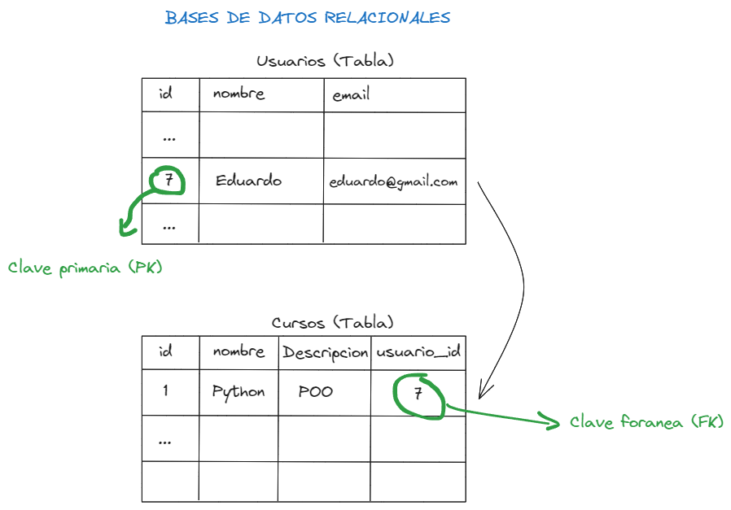
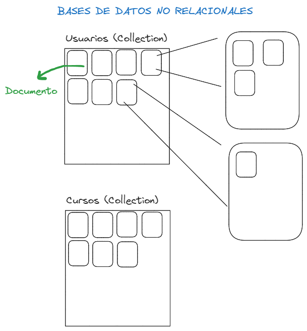

# BASES DE DATOS

## Tipos de bases de datos

- **SQL**: Relacionales

La base de datos relacional es un tipo de base de datos que almacena y proporciona acceso a puntos de datos relacionados entre sí. Las bases de datos relacionales se basan en el modelo relacional, una forma intuitiva y directa de representar datos en tablas. En una base de datos relacional, cada tabla tiene una clave primaria que la identifica de forma única. Las tablas también pueden tener claves foráneas, que establecen relaciones entre los datos almacenados en diferentes tablas. Las bases de datos relacionales son muy populares y se utilizan en una amplia variedad de aplicaciones, desde aplicaciones de comercio electrónico hasta sistemas de gestión de contenido.



- **NoSQL**: No relacionales

Las bases de datos NoSQL son un tipo de base de datos que no sigue el modelo relacional. En lugar de tablas, las bases de datos NoSQL almacenan datos en estructuras como documentos, gráficos o columnas. Las bases de datos NoSQL son muy flexibles y pueden manejar grandes volúmenes de datos no estructurados. Son ideales para aplicaciones que requieren una alta escalabilidad y rendimiento, como las aplicaciones web y móviles. Las bases de datos NoSQL son muy populares en la actualidad y se utilizan en una amplia variedad de aplicaciones, desde redes sociales hasta análisis de big data.



## Crear una tabla

```sql
CREATE TABLE movies (
    id SERIAL PRIMARY KEY,
    title VARCHAR(100),
    director VARCHAR(100),
    year INT
    length_minutes INT
)
```

## Insertar registros

```sql
INSERT INTO movies (title, director, year, length_minutes) VALUES
('Toy Story', 'John Lasseter', 1995, 81),
('Finding Nemo', 'Andrew Stanton', 2003, 100),
('The Incredibles', 'Brad Bird', 2004, 115),
('Ratatouille', 'Brad Bird', 2007, 111),
('Up', 'Pete Docter', 2009, 96),
('Toy Story 3', 'Lee Unkrich', 2010, 103),
('Inside Out', 'Pete Docter', 2015, 95),
('Coco', 'Lee Unkrich', 2017, 105),
('Toy Story 4', 'Josh Cooley', 2019, 100),
('Soul', 'Pete Docter', 2020, 100);
```

## SELECT

```sql
--- Seleccionar todos los registros
SELECT * FROM movies;

--- Seleccionar campos específicos
SELECT title, year FROM movies;

--- Seleccionar registros con condición
SELECT * FROM movies WHERE id = 1;
```

## Busqueda con restricciones

- **=, !=, <, >, <=, >=**: Operadores de comparación para valores numéricos y de texto

```sql
SELECT * FROM movies WHERE year = 2000;
```

- **BETWEEN**: Filtrar por rango de valores

```sql
SELECT * FROM movies WHERE year BETWEEN 2000 AND 2010;
SELECT * FROM movies WHERE year >= 2000 AND year <= 2010;
```

- **NOT BETWEEN**: Filtrar por rango de valores excluyendo los valores del rango

```sql
SELECT * FROM movies WHERE year NOT BETWEEN 2000 AND 2010;
```

- **IN**: Filtrar por lista de valores

```sql
SELECT * FROM movies WHERE year IN (2000, 2005, 2010);
```

- **NOT IN**: Filtrar excluyendo una lista de valores

```sql
SELECT * FROM movies WHERE year NOT IN (2000, 2005, 2010);
```

- **LIKE**: Filtrar por patrón

````sql
SELECT * FROM movies WHERE title LIKE 'Toy%';

- **NOT LIKE**: Filtrar excluyendo un patrón

```sql
SELECT * FROM movies WHERE title NOT LIKE 'Toy%';
````

- **%**: Cualquier cadena de caracteres
- **\_**: Un solo caracter

## Ordenar resultados

- **ORDER BY**: Ordenar resultados

```sql
SELECT * FROM movies ORDER BY id DESC;
```

- **ASC**: Ordenar de forma ascendente
- **DESC**: Ordenar de forma descendente

## Limitar resultados

- **LIMIT**: Limitar cantidad de registros

```sql
SELECT * FROM movies LIMIT 5;
```

- **OFFSET**: Saltar cantidad de registros

```sql
SELECT * FROM movies LIMIT 5 OFFSET 5;
```


## Operadores AND, OR, NOT

- **AND**: Operador lógico Y

```sql
SELECT * FROM movies WHERE year >= 2000 AND year <= 2010;
```

- **OR**: Operador lógico O
    
```sql
SELECT * FROM movies WHERE year = 2000 OR year = 2010;
```

- **NOT**: Operador lógico NO

```sql
SELECT * FROM movies WHERE NOT year = 2000;
```

## Operador UPDATE

- **UPDATE**: Actualizar registros

```sql
UPDATE movies SET year = 2000 WHERE id = 1;
UPDATE movies SET year = 2000 WHERE year = 1999;
```

## Operador DELETE

- **DELETE**: Eliminar registros

```sql
DELETE FROM movies WHERE id = 1;
```

## Operador JOIN

- **JOIN**: Unir tablas

```sql
SELECT title, domestic_sales, international_sales
FROM movies
JOIN boxoffice ON movies.id = boxoffice.movie_id;
```